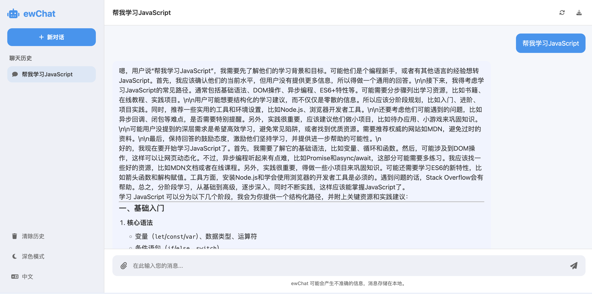

## ewChat

### 说明

请自行前往[openrouter ai](https://openrouter.ai/deepseek/deepseek-r1:free/api)申请一个免费的 key，然后修改 src/config.ts 中的变量。

```ts
// src/config.ts
// 你自己申请的api_key
export const API_KEY = "xxxx";
```

然后就可以在本地使用了。

### 项目运行

```bash
pnpm i
pnpm run dev
```

访问运行地址即可。运行效果如下图所示:


